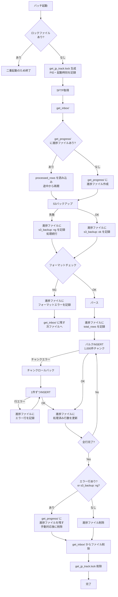

# logistic_track テーブル更新仕様書 (2)
---
## 概要
日本郵便からSFTP経由で取得した追跡情報CSVを解析し、`logistic_track` テーブルへINSERTする処理フローを定義する。最大20万件/ファイルを想定。

---
## 1. 全体フロー

---
## 2. INSERT方式
### 重複チェック
INSERT前に `tracking_no + baggage_status + report_date` の3項目でDBを照会し、既存レコードと一致する行はスキップする。チャンク単位でSELECTしてメモリ上で照合する。

### バルクINSERT
- 1,000件単位（`BULK_INSERT_CHUNK_SIZE`）でチャンク分割してINSERT
- チャンク単位でコミット

### エラー時フォールバック
チャンク内でエラーが発生した場合、そのチャンクをロールバックし、1件ずつINSERTに切り替えて再試行する。
- 正常な行はINSERT
- エラーになった行は進捗ファイルに記録してスキップ（バッチ継続）

> `logistic_track` はPKである `id`（自動採番）のみで、`tracking_no + report_date + baggage_status` に対するユニーク制約は存在しない。既存テーブルのためスキーマ変更は行わず、UPSERTではなく全件INSERTとする。重複行は上記の重複チェックで検出しスキップする。

### 障害時の再開
バッチ起動時に `get_progress/` に対象CSVの進捗ファイルが存在する場合、`processed_rows` を読み込み、それ以降の行のみを処理対象とする（処理済み行はスキップする）。

---
## 3. 進捗ファイル仕様

ファイル名：`{元CSVファイル名}.progress.json`

各フィールドはエラー時に `"ng"` またはエラー内容の文字列が入る。正常時は `"ok"` または `null`。
`processed_rows` は処理済み行数を示し、再起動時はその次の行から再開する。処理中は `updated_at` がチャンク完了ごとに更新される。

```json
{
  "source_file": "track_20231223.csv",
  "started_at": "2023/12/23 13:05:12",
  "updated_at": "2023/12/23 13:06:45",
  "s3_backup": "ok",        // 失敗時: "ng"
  "format_error": null,     // NGの場合: エラー内容の文字列
  "total_rows": 15000,
  "processed_rows": 3000,   // 3001行目以降が未処理
  "inserted_rows": 2998,
  "error_rows": {
    "count": 2,
    "rows": [
      {"row": 152, "tracking_no": "494735708622", "reason": "Duplicate entry"},
      {"row": 880, "tracking_no": "494735708701", "reason": "Duplicate entry"}
    ]
  }
}
```

---
## 4. エラー時の挙動

| フェーズ | 状況 | 挙動 |
|---------|------|------|
| フォーマットチェック | カラム数不正・空値・日時形式不正 | 進捗ファイルにエラー内容を記録 → `get_inbox/` に残す → 次ファイルへ（バッチ継続）。修正後に再実行することで処理される |
| バルクINSERT | チャンク単位のDBエラー | チャンクをロールバック → 1件ずつINSERTにフォールバック |
| 1件ずつINSERT | 行単位のDBエラー | 進捗ファイルにエラー行を記録・スキップ（バッチ継続） |
| 全行完了・エラーあり | - | `get_progress/` に進捗ファイルを残す（エラー行記録済み）→ 作業者が手動対応後に削除 |
| 全行完了・エラーなし | - | 進捗ファイル削除 |
| S3バックアップ | アップロード失敗 | 進捗ファイルに `s3_backup: ng` を記録して処理続行。完走後も進捗ファイルは残す |

---
## 5. ワークディレクトリ

| ディレクトリ | 用途 |
|-------------|------|
| `work/get_inbox/` | SFTPから取得したCSVの一時置き場 |
| `work/get_progress/` | 処理中の進捗ファイル（処理済み行数・エラー行）|
| `work/` | `get_jp_track.lock`：二重起動防止用ロックファイル。中身はPIDと起動時刻。バッチ起動時に生成、正常・異常終了時に削除 |

---
## 6. 未確認事項

| # | 確認事項 | 確認先 |
|---|---------|--------|
| 1 | ユニーク制約がないためUPSERTは実行できず、全件INSERTで対応する想定だが問題がないか | 開発課 |
